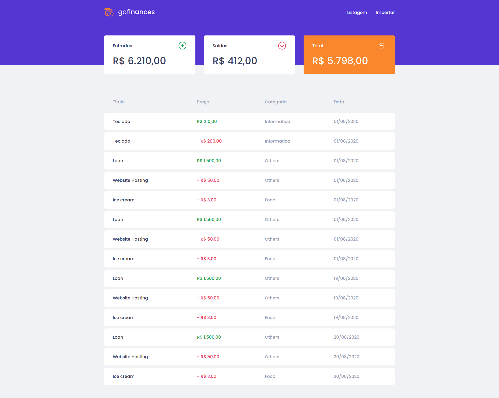
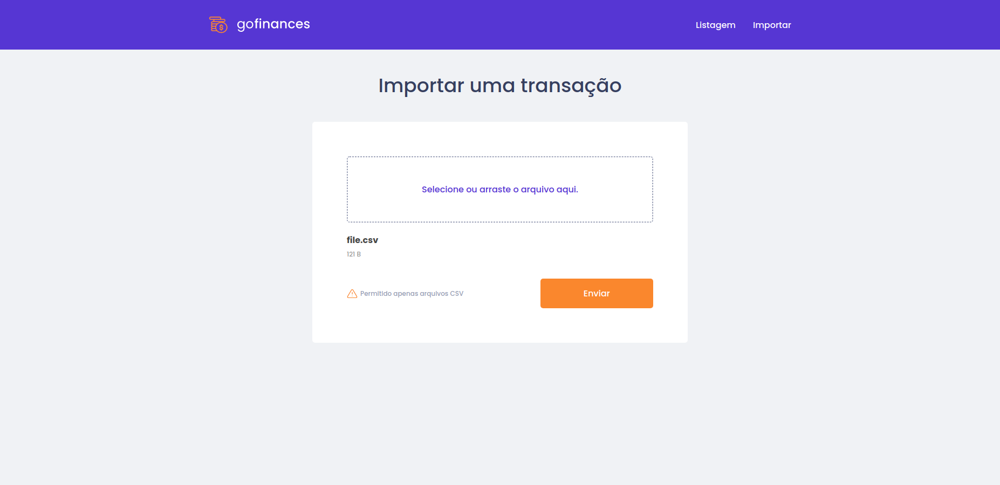

<h1 align="center">
   GoFinances API
</h1>

## :camera: Demonstração

## :rocket: Tecnologias

Esse projeto foi desenvolvido com as seguintes tecnologias:

✔️Typescript

✔️Node.js

✔️Express

✔️Docker

✔️Typeorm

✔️PostgreSQL

✔️Multer

✔️csv-parse

✔️Eslint

✔️Prettier

## 💻 Projeto

Go Finances API é desenvolvido em nodeJs, serve para controlar entradas, saídas e balanço de uma aplicação web.
